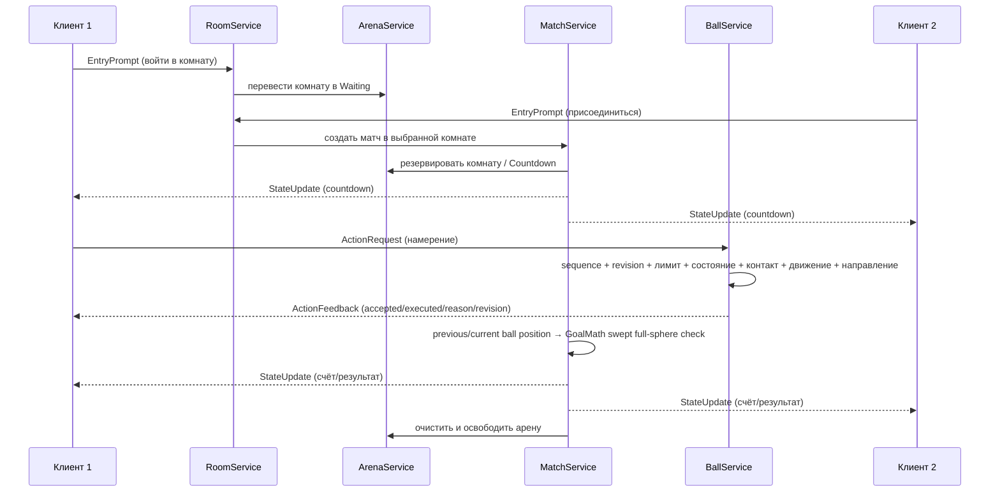

# Архитектура

## Цели

Архитектура MVP решает четыре задачи:

1. отделяет визуальный ввод клиента от решений сервера;
2. позволяет нескольким матчам использовать разные арены одного сервера;
3. не связывает игровую логику с вручную собранной картой;
4. оставляет понятные точки расширения для 2v2, рейтинга и приватных матчей.

## Размещение Rojo

`default.project.json` формирует следующую структуру DataModel:

```text
ReplicatedStorage
└── PannaShared             ← src/shared
ServerScriptService
└── PannaServer             ← src/server
StarterPlayer
└── StarterPlayerScripts
    └── PannaClient         ← src/client
Workspace
└── PannaDistrict           ← запечённая Rojo-модель; сервер проверяет/инициализирует её
```

`default.project.json` подключает `src/world/PannaDistrict.model.json`, поэтому карта доступна в Edit Mode. Это единственный release-manifest и источник единственного пользовательского place. `source.project.json` намеренно не подключает модель: bake-процесс запускает `WorldBuilder` в чистом place, экспортирует результат и затем собирает основной проект. `world.project.json` описывает только корень района для отдельной проверки/экспорта. `multiplayer.project.json` повторяет основной runtime mapping и добавляет тестовые server/client-скрипты из `tests/`; в релизный place они не попадают. Эти три файла — внутренние профили одного проекта, а не отдельные Roblox-игры; валидатор запрещает появление дополнительных `*.project.json`.

Общие модули доступны обеим сторонам, но не должны содержать серверные секреты или давать клиенту право менять результат.

## Слои и ответственность

| Слой/модуль | Ответственность | Не должен делать |
| --- | --- | --- |
| `Config` | Баланс, размеры мира, таймеры, лимиты, награды | Хранить состояние матча |
| `Net` | Единые имена RemoteEvent/RemoteFunction | Доверять входному payload |
| `Types` | Общие типы профиля, арены и матча | Выполнять игровую логику |
| `WorldBuilder` | Процедурно создать единственный `BrightBlockDistrict`, шесть зелёных комнат и канонические мячи; версионировать/восстанавливать шесть панелей и тонкий trail каждого мяча | Управлять очередью или счётом |
| `RemoteRegistry` | Создать/найти сетевые объекты с ожидаемыми классами | Принимать игровые решения |
| `RateLimiter` | Ограничить частоту запросов игрока | Считать действие валидным только из-за допустимой частоты |
| `ArenaService` | Обнаружить шесть арен, резервировать поле для матча, управлять барьером/табло и возвращать игроков на улицу | Назначать награды |
| `RoomService` | Обработать комнатные `EntryPrompt`/`ExitPrompt`, ожидание второго игрока и переходы `Free/Waiting/Countdown/Active/Result` | Симулировать мяч или выдавать награды |
| `PlayerDataService` | Загрузка, схема, autosave, безопасное сохранение и награды | Принимать значения валюты от клиента |
| `QueueService` | Вход/выход из очереди, проверка профиля/персонажа, формирование пары, rematch | Самостоятельно симулировать матч |
| `MatchService` | Машина состояний матча, таймер, full-sphere swept-голы, overtime, серверная блокировка/разблокировка управления и завершение | Полагаться на клиентский таймер или клиентский сигнал гола |
| `BallService` | Всегда незакреплённый server-owned мяч, плавное PD-ведение, stationary close-control/protection, прямой tackle takeover, cushion/Trap, ограниченная помощь направления, release-импульсы, панна, drag/Magnus, изоляция арен и sanity-проверка | Применять произвольную силу или позицию клиента без проверки |
| `BallMath` | Чистые расчёты направления, charge, плавной дистанции контроля, cushion/assist, физической цели/PD, launch-скорости, speed-derived roll и аэродинамического/Magnus-ускорения | Читать состояние матча или перемещать Instances |
| `GoalMath` | Чистая геометрия плоскости ворот, swept-точки полного пересечения сферы и проверки створа | Начислять счёт или выполнять debounce |
| `PannaDetector` или логика мяча | Проверка кандидата на панну | Засчитывать одну клиентскую анимацию как панну |
| `ControlCatalog` | Единые binding names, Enum inputs, HUD/touch labels и девять разделов инструкции для всех устройств | Выполнять Remote-команды или хранить состояние матча |
| `ProceduralPoseCatalog` | Asset-free аддитивные позы Charge, Low/Normal/Chip, Pass, Trap, Shield, Dash, Tackle, Skill/Panna и четырёх Feint-вариантов | Перемещать `HumanoidRootPart`, мяч или другой объект мира |
| `PlayerAnimationController` | Привязка R6/R15 `Motor6D`/кинематических `AnimationConstraint`, scoped `PlayerAction`, аддитивный `PreSimulation`, восстановление joints и lifecycle reset | Менять физику, root transform или принимать решение об исполнении действия |
| `FootballVFXController` | Локальные Beam/Part/Highlight: отправляемое направление, приблизительная charge-траектория, фактическая скорость мяча и scoped action VFX с бюджетом/cleanup | Менять мяч, персонажа, collision, счёт или трактовать preview как серверный результат |
| клиентский контроллер | Ввод, контекстный выбор ЛКМ по реплицированному `OwnerUserId` (`Kick` при своём владении, `Tackle` при чужом), камера, HUD, modal guide, мобильные кнопки, эффекты, процедурные позы и идемпотентный reset transient-состояния/PlayerModule controls | Назначать результат отбора, гол, победу, монеты или рейтинг |

Фактический набор файлов может объединять тесно связанные обязанности, однако направление зависимостей остаётся прежним: клиент выражает намерение, сервер валидирует и публикует состояние.

## Сетевой контракт

Объекты создаются в `ReplicatedStorage/PannaRemotes`. Имена задаёт `src/shared/Net.lua`.

| Имя | Направление | Назначение |
| --- | --- | --- |
| `ActionRequest` | клиент → сервер | Намерение начать заряд, ударить, отдать пас, принять мяч, выполнить отбор, финт, защиту, панну или рывок |
| `ActionFeedback` | сервер → клиент | Подтверждение или отказ для конкретного `sequence`, фактический cooldown, revision и контекст действия |
| `QueueRequest` | клиент → сервер | Вход/выход из очереди и поддерживаемые действия после матча |
| `StateUpdate` | сервер → клиент | Авторитетный снимок очереди, матча, счёта и времени |
| `Effect` | сервер → клиент | Scoped визуальный/текстовый эффект, включая `PlayerAction` для позы; не источник игрового результата |
| `GetSnapshot` | клиент → сервер → клиент | Начальная синхронизация после загрузки клиента |

Любое добавление Remote должно одновременно обновить `Net`, серверный обработчик, проверку payload, rate limit и документацию безопасности.

### Payload MVP

`QueueRequest` принимает одну из строк: `"Join"`, `"Leave"`, `"Rematch"`. Сервер отклоняет другие типы и операции.

`ActionRequest` принимает таблицу намерения:

```lua
{
    action = "ChargeStart" | "Kick" | "Pass" | "Trap" | "Tackle"
        | "Feint" | "Shield" | "Skill" | "Dash",
    sequence = 42,               -- строго возрастает внутри клиентской сессии
    arenaId = "Arena_1",
    matchId = "server-match-id",
    ballRevision = 17,           -- последняя подтверждённая версия состояния мяча
    clientTime = workspace:GetServerTimeNow(),
    direction = planarDirection, -- единичный Vector3; не нужен для ChargeStart/ShieldOff
    moveDirection = moveDirection,

    chargeAction = "Kick" | "Pass",         -- только ChargeStart
    shotType = "Normal" | "Low" | "Chip", -- только Kick
    spin = -1.0,                 -- только Kick; ограниченная подкрутка от поперечного движения
    variant = "StepOver" | "Cut" | "DragBack" | "Roulette", -- только Feint
    lateral = 0.0,               -- только Feint, диапазон -1...1
    active = true,               -- только Shield
}
```

Клиентская `power` может использоваться только для локального отображения шкалы. Фактическую силу удара/паса сервер вычисляет по времени между принятым `ChargeStart` и отпусканием. До исполнения проверяются активный матч, `sequence`, `arenaId`, `matchId`, revision, время, живой персонаж, история движения, контакт, направление, владение и cooldown.

`ActionFeedback` содержит `accepted`, `executed`, `reason`, `action`, исходный `sequence`, `cooldownSeconds`, актуальный `revision`, `controllerUserId`, подрежим действия (`mode`, например `Chip`) и физическое состояние (`ballState`). `accepted = true, executed = false, reason = "Buffered"` означает разрешённый буфер первого касания, а не ошибку. Клиент запускает cooldown только после этого серверного ответа.

Каждый мяч реплицирует дискретные атрибуты `BallState`, `BallRevision`, `OwnerUserId`, `LastTouchUserId` и `LastAction`. Допустимые состояния: `Free`, `Controlled`, `Contested`, `Shot`, `Flight`, `Bounce`, `Reset`. Отдельный Remote-поток позиций не используется: во всех состояниях Roblox реплицирует server-owned физику незакреплённой сферы, а клиент получает только атрибуты для HUD/диагностики.

### Инвариант мяча

Матчевый `Ball` во всех состояниях сохраняет `Anchored = false` и server network ownership (`SetNetworkOwner(nil)`). В обычном `Controlled` сервер каждый Heartbeat строит цель по проверенной и ограниченной горизонтальной `HumanoidRootPart.AssemblyLinearVelocity`, если игрок действительно движется, либо по реплицируемому горизонтальному `HumanoidRootPart.LookVector` при остановке. Принятый `Feint` сохраняет текущую позицию сферы как `holdPosition`: на короткое время цель перестаёт следовать игроку, carrier velocity заменяется нулём, а более жёсткий ограниченный PD-расчёт тормозит и удерживает мяч. За это время `_updatePossession` не выполняет пассивную смену владельца, а контактный `Tackle` расходует cooldown и возвращает `DribbleProtected`. После окна обычный контроль и возможность отбора восстанавливаются. Клиент не присылает `holdPosition`, силу или длительность.

`Workspace:Spherecast` используется только как obstacle guard: он сокращает физическую цель перед бортом/стойкой и при длительной блокировке приводит к потере контроля, но никогда не записывает `CFrame` мяча. Первый приём и начало close-control гасят скорость ограниченными импульсами. Чистый `Tackle` сразу переводит `Controlled` от прежнего владельца к отбирающему, блокирует пассивный recapture прежнего игрока на короткий grace и также гасит остаточную скорость. При ударе, низком пасе или панне контролирующие `VectorForce`/`Torque` выключаются, а чистые `LaunchVelocity`/`LaunchAngularVelocity` задают тому же незакреплённому мячу дугу и roll. Только негрунтовые action-состояния получают ограниченный drag/trail. Reset — отдельная авторитетная операция возврата на `BallSpawn`.

`WorldBuilder` создаёт на сфере шесть massless, non-colliding `PannaBallPanel_01`…`06`, соединённых `WeldConstraint`, и помечает корень/мяч `BallVisualVersion`. Несовпадение версии делает bake несовместимым, а повреждённый набор панелей восстанавливается. Панели и нейтральный trail не являются источником физики; они только делают фактическое вращение и быстрый воздушный полёт читаемыми. Текущий контракт входит в канонический bake и проверен Studio Edit `RunScript`; масштаб, читаемость вращения и отсутствие эффекта «летающей тарелки» ещё требуют обычного визуального Play QA.

### Процедурная анимация игрока

После принятого действия `BallService` публикует визуальную cue, а `MatchService` оборачивает её в scoped `Effect` с `kind = "PlayerAction"`, `matchId`, `arenaId`, `matchRevision`, `actorUserId`, `action`, `mode`, `lateral`, монотонной `visualRevision` и `serverTime`. Клиент принимает cue только для текущих матча/арены и допустимого времени, а старую или повторную ревизию не проигрывает. Это презентационный канал: право ударить, отдать пас, выполнить финт или панну остаётся у серверной игровой логики.

`ProceduralPoseCatalog` возвращает только локальные `CFrame`-offsets нормализованных joints. Покрыты Charge, Kick (`Low`, `Normal`, `Chip`), Pass, Trap, Shield, Dash, Tackle, Skill/Panna и Feint (`StepOver`, `Cut`, `DragBack`, `Roulette`). `PlayerAnimationController` находит R6/R15 joints по именам, предпочитает кинематический `AnimationConstraint` при AvatarJointUpgrade и использует `Motor6D` как обычный путь. На `PreSimulation` контроллер читает уже рассчитанный Animator transform, добавляет визуальный offset и затем восстанавливает только собственную добавку; `HumanoidRootPart`, `CFrame` частей мира, скорости, силы и физика мяча этим слоем не меняются.

Charge и Shield существуют как удерживаемые позы и завершаются серверной `Stop` cue. Для Kick/Pass остановка Charge публикуется до release-анимации даже при отклонённом отпускании; серверный charge имеет аварийный timeout `ChargeMaximumSeconds = 4`. Scoped `Stop/Cancel` с новой visual revision снимает hold даже после клиентской паузы, когда его timestamp уже устарел, а локальный шестисекундный hard-timeout страхует от потерянной cue. Смена Character очищает серверное transient-состояние и рассылает Stop, а локальные CharacterRemoving/CharacterAdded, блокировка управления, результат, отмена и выход восстанавливают joints и очищают позы. `ActionFeedback` доходит до анимаций только после проверки pending `sequence` и контекста в `InputController` и не перематывает уже принятую авторитетную Charge cue.

`FootballVFXController` получает тот же рассчитанный `InputController` горизонтальный direction до отправки команды. Постоянный aim guide показывается только локальному владельцу контролируемого мяча; charge dots используют копию базовых speed/lift-настроек как приблизительную подсказку. После release motion guide читает только реплицированный `AssemblyLinearVelocity`. Scoped `Effect` запускает косметические импульсы уже после проверки матча/арены, а все созданные части локальны, неколлизионны и ограничены `MaximumTransientParts`. Корневой bake хранит `VFXVersion`, но сами runtime-эффекты в статическую карту не запекаются.

Снимок `GetSnapshot` и частичные `StateUpdate` используют три верхнеуровневые области:

- `queue = { joined, status, position }`;
- `match = table | false | nil` с `id`, монотонной `revision`, `state`, именами сторон, голами, паннами, `remaining`, `endsAt`, `serverNow`, `goldenGoal`; полный snapshot также несёт верхнеуровневую `matchRevision`, даже когда активного матча уже нет;
- `stats` с публичными `Wins`, `Losses`, `Goals`, `Pannas`, `Coins`, `Level`, `XP`, `Rating`, `WinStreak`.

`Effect` передаёт только презентационные данные: `kind = "Goal" | "Panna" | "Result" | "Message" | "PlayerAction"`, обязательные для матчевого события `matchId`/`arenaId`/`matchRevision`, а также допустимые поля результата/сообщения или actor/action/mode/lateral/visualRevision/serverTime для позы. Клиент выбирает самый новый контекст по серверной ревизии и не откатывает его при иной очередности репликации атрибутов, `StateUpdate`, `GetSnapshot` и `Effect`; это защищает реванш от запоздалого `Result`, старого snapshot и повторной action cue.

## Поток одного матча



## Машина состояний

Базовые состояния определены общим типом `MatchState`:

```text
Countdown → Active → GoalPause → Active
                    ↘ Overtime → Finished
          выход/ошибка/лимит голов ↗
```

- `Countdown`: живые персонажи проверены до резервирования, игроки размещены, действия заблокированы, мяч в центре; readiness повторно проверяется перед `Active`.
- `Active`: идёт основное время.
- `GoalPause`: гол уже подтверждён сервером, управление временно остановлено, затем позиции сбрасываются.
- `Overtime`: дополнительное время; конфигурация может включать golden goal.
- `Finished`: результат зафиксирован один раз, допустимые обычные завершения награждаются идемпотентно, арена освобождается. Disconnect/отмена и небезопасный профиль наград не получают.

Состояния в интерфейсе являются проекцией серверного матча. Локальное окончание клиентского таймера не завершает матч. Гол также не является событием клиента: `MatchService` хранит предыдущую позицию центра, строит направленную от поля плоскость передней грани Goal marker и вызывает `GoalMath`. Счёт меняется только если swept-отрезок переводит центр дальше `radius + epsilon`, сфера целиком проходит створ, направление идёт поле → ворота и episode debounce ещё свободен.

`Score.Home`/`Away` — общие матчевые очки, определяющие победителя и лимит. `HomeGoals`/`AwayGoals` отдельно считают только пересечения ворот для постоянной статистики/награды, а `HomePannas`/`AwayPannas` — подтверждённые панны. Такое разделение не позволяет очку панны случайно увеличить статистику голов.

## Данные игрока

Схема профиля включает версию, победы, поражения, голы, панны, серию побед, рейтинг, уровень, XP, монеты, купленную/выбранную косметику, настройки и недавние идентификаторы наград. Поля и значения по умолчанию находятся в общем типе и сервисе данных.

Принципы миграции:

- увеличивать `SchemaVersion` при несовместимом изменении;
- добавлять отсутствующие поля безопасными значениями по умолчанию;
- не считать клиентскую копию профиля источником истины;
- не повторять награду с уже обработанным идентификатором матча;
- при ошибке DataStore завершать матч корректно и явно журналировать невозможность сохранения.

### Session lease

Загрузка атомарно использует `UpdateAsync`: каждый вызов load получает уникальный lease ID, составленный из идентификатора серверной сессии и нового GUID, и `SessionLock` сроком на 180 секунд. Поэтому быстрый rejoin одного UserId в тот же сервер не делает старый и новый объекты `Player` одним владельцем. Обычная запись требует точного совпадения `SessionLock.Id`, продлевает lease и сериализуется per-player guard, чтобы autosave и выход не писали одновременно. Чистый выход и shutdown запрашивают финальное сохранение с освобождением lock; повтор release считается успешным только для уже отсутствующего lock, но не пишет stale-данные. Shutdown прекращает новые загрузки и в пределах общего budget до 25 секунд ожидает активные load/save и release.

Если получение DataStore недоступно уже при создании сервиса — типичный случай для непубликованного локального place — игрок сразу получает session-only профиль без lease и без попыток сохранения. Такой профиль выставляет `DataLoaded = true` и `DataSessionFallback = true`, чтобы Studio-прогон механик не зависал на загрузке данных. Тот же fallback используется, если другой живой session lock не истёк или DataStore недоступен после ограниченных retry; проект не записывает пустой профиль поверх данных. Неподтверждённый autosave также помечает сессию небезопасной: награды не применяются, а published-сервер блокирует рейтинговую очередь до успешного подтверждённого save; Studio разрешает fallback-матч только для локальной разработки. Это базовая защита одного проекта, а не полный внешний ProfileStore/teleport handoff.

## Жизненный цикл и очистка

При завершении матча или отключении игрока сервисы должны:

1. остановить таймеры и соединения конкретного матча;
2. снять владение мячом и вернуть его в допустимую точку;
3. удалить временные эффекты;
4. очистить атрибуты игроков;
5. сбросить `Busy`/`MatchId` арены;
6. не выдать результат повторно при конкурирующих событиях;
7. серверно снять `ControlsLocked` и восстановить `WalkSpeed`, `JumpHeight`/`JumpPower` у текущего `Humanoid`, в том числе после respawn в result-паузе;
8. клиентским единым reset отменить charge/Shield/Trap/Dash/pending actions, восстановить аддитивно изменённые joints, очистить transient HUD/touch, включить PlayerModule controls и привязать камеру к текущему Humanoid;
9. вернуть оставшегося игрока к `StreetSpawn` комнаты (с запасным возвратом в лобби) после предусмотренной паузы.

Оба reset-пути идемпотентны и вызываются по lifecycle-атрибутам/снимкам, а не по предположению клиента о причине завершения. Изолированные cleanup-циклы, выборки поз, восстановление transforms и scoped cue проверены Studio Edit `RunScript`; два обычных client Play-матча подряд и ручной визуальный respawn-прогон остаются обязательной regression-проверкой.

## Расширение

- **2v2:** заменить пару на состав команды, сохранив интерфейс Arena/Match.
- **Кросс-серверная очередь:** отдельный слой MemoryStore/Teleport; локальный QueueService оставить адаптером одного сервера.
- **Приватные матчи:** другой источник участников, тот же ArenaService и MatchService.
- **Боты:** серверный провайдер намерений, который проходит те же ограничения действий.
- **Вручную созданные карты:** соблюсти [контракт мира](world-contract.md), не меняя правила матча.
